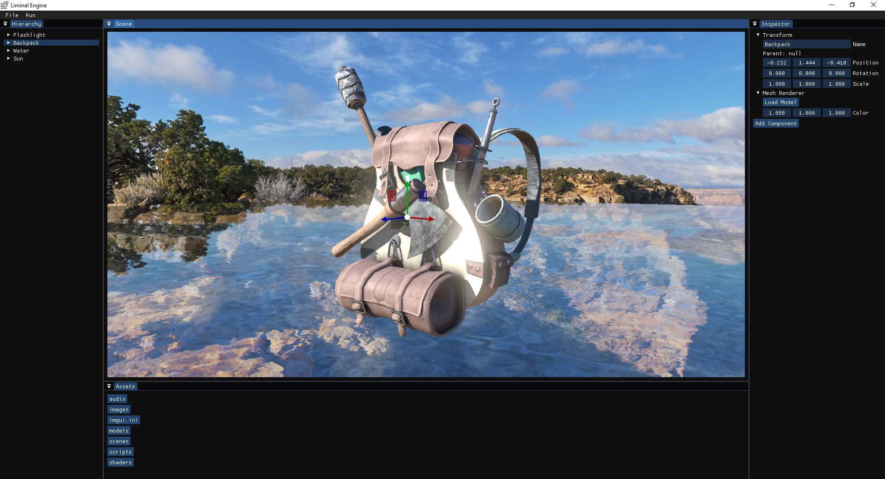

# Liminal Engine

## Getting Started

### Download

```sh
git clone https://github.com/daviskauffmann/liminal-engine.git
cd liminal-engine
git submodule update --init
```

### Install Dependencies

Install the following using the package manager of your choice:

- Assimp
- Bullet3
- cxxopts
- EnTT
- GLEW
- GLM
- ImGui [docking-experimental,opengl3-binding,sdl2-binding]
- Lua
- nlohmann-json
- OpenAL Soft
- SDL2
- SDL2-image [libjpeg-turbo]
- SDL2-mixer
- sol2
- stb

### Build

```sh
mkdir build
cd build
cmake ..
```

## Features

- Deferred shading
- PBR w/ metallic workflow
- HDR
- Bloom
- Light sources and shadow mapping
  - Directional
  - Point
  - Spot
- Water
  - Planar reflections
  - Refraction
- 3D sound
- Runtime shader reloading
- Model loading (WIP)
- Terrain (WIP)
- 2D sprites (WIP)
- Physics (WIP)
- LUA scripting (WIP)
- Animation (WIP)
- Entity-component-system using EnTT
- Real-time level editing (WIP)

### Upcoming

- Transparency
- Ambient occlusion
- Particles
- Fog and other atmospheric effects
- Underwater effects
- Anti-aliasing

## Screenshots



## Resources Used

[Learn OpenGL](https://learnopengl.com)

[opengl-tutorial.org](http://www.opengl-tutorial.org)

[ogldev](http://ogldev.atspace.co.uk)

[Lazy Foo' Productions](https://lazyfoo.net)

[thebennybox](https://www.youtube.com/user/thebennybox)

[ThinMatrix](https://www.youtube.com/user/ThinMatrix)

[The Cherno](https://www.youtube.com/user/TheChernoProject)

[Hopson](https://www.youtube.com/channel/UCeQhZOvNKSBRU0Mdg7V44wA)

[Byungil Jeong - CS594 - Project 2](https://www.evl.uic.edu/bijeong/cs594/proj2)

[Bones animation with OpenGL, ASSIMP and GLM](http://www.xphere.me/2019/05/bones-animation-with-openglassimpglm/)

[A Simple Entity Component System](https://austinmorlan.com/posts/entity_component_system/)
