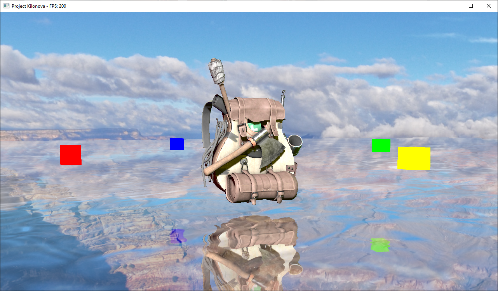
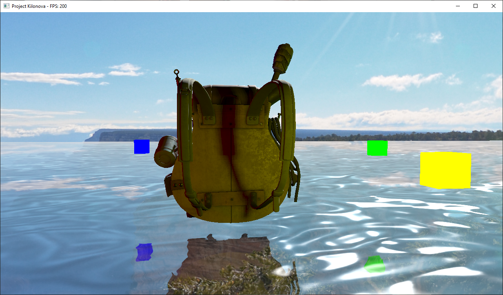

# Project Kilonova

## Getting Started

### Dependencies

Make sure the following are present on your system:

- Assimp
- Bullet
- GLEW
- GLM
- OpenAL
- SDL2
- SDL2_image
- SDL2_mixer

These dependencies are included as submodules:

- Dear ImGui
- stb

### Download

```sh
git clone https://github.com/daviskauffmann/project-kilonova.git
cd project-kilonova
git submodule update --init
```

### Build

```sh
make
```

### Build & Run

```sh
make run
```

### Cleanup

```sh
make clean
```

## Features

- Light sources and shadow mapping
  - Directional
  - Point
  - Spot
- Water
  - Planar reflections
  - Refraction
- Model loading (WIP)
- HDR
- Bloom
- Deferred shading
- PBR w/ metallic workflow
- 3D sound
- Runtime shader reloading
- Terrain (WIP)
- 2D sprites (WIP)

### Upcoming

- Physics
- Transparency
- Ambient occlusion
- Particles
- Fog and other atmospheric effects
- Underwater effects
- Anti-aliasing
- Animation
- Real-time level editing
- LUA scripting

## Screenshots




## Resources Used

[Learn OpenGL](https://learnopengl.com)

[opengl-tutorial.org](http://www.opengl-tutorial.org)

[thebennybox - 3D Game Engine Tutorial](https://www.youtube.com/playlist?list=PLEETnX-uPtBXP_B2yupUKlflXBznWIlL5)

[ThinMatrix - OpenGL 3D Game Tutorials](https://www.youtube.com/playlist?list=PLRIWtICgwaX0u7Rf9zkZhLoLuZVfUksDP)

[ThinMatrix - OpenGL Water Tutorials](https://www.youtube.com/playlist?list=PLRIWtICgwaX23jiqVByUs0bqhnalNTNZh)

[The Cherno - Game Engine](https://www.youtube.com/playlist?list=PLlrATfBNZ98dC-V-N3m0Go4deliWHPFwT)
